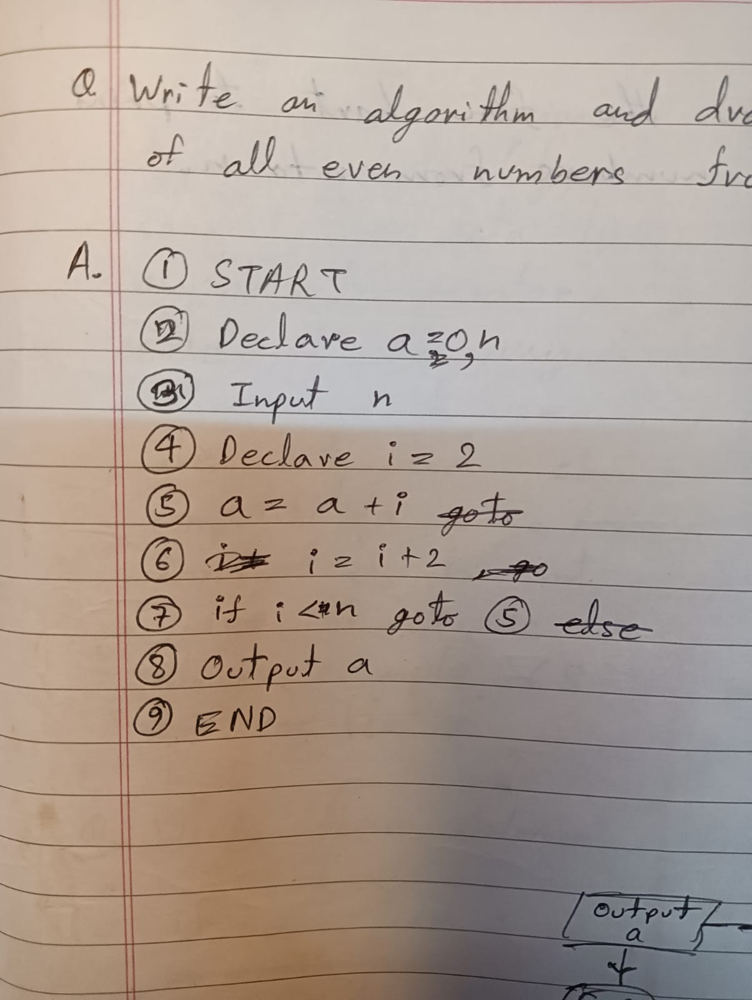

## So what is AlgoLang?

i was being taught to write algorithms in class and i was like "hmmm, you know what? what if i make this into a programming language? will be kinda cool ngl, and i can make it in C++ to sort of challange myself" so i created this repo made a simple file loading system and forgot about it. a week or so later i suddently remember about this and then pulled an all nighter finishing it. it works pretty well and even follows BODMAS rule for arithmatic stuff. for that i had to learn about something called recursive descent parser which is used in low level compilers and stuff so that was pretty cool. 

actual image of an algorithm i wrote in class (ignore my handwriting, i was distracted by the pretty girl sitting near me):



### Currently Available Keywords:

* **START** - defines where the program starts
* **END** - defines where the program stops executing
* **DECLARE** - used to declare variables
* **GOTO** - start interpreting from a specific line
* **IF** - if conditional
* **OUTPUT** - output variable, integer, strings
* **INPUT** - input integers, floats and strings

oh and i also got dynamic variable allocation working which was pretty cool to make. you just type an input and the interpreter decides on its own what kind of input it is and stores it in that variable. pretty cool right?

---

## Examples

### Prime Number Generator
```text
START
DECLARE n, i, j, is_prime, rem
INPUT n
i = 2
IF i > n GOTO 19
j = 2
is_prime = 1
IF j == i GOTO 15
rem = i % j
IF rem == 0 GOTO 13
j = j + 1
GOTO 8
is_prime = 0
GOTO 15
IF is_prime == 0 GOTO 17
OUTPUT i
i = i + 1
GOTO 5
END

```

**Output:**

```cmd
E:\AlgoLang>algo.exe ./src/test.txt
Enter value for n: 10
>> 2
>> 3
>> 5
>> 7

E:\AlgoLang>

```

### Factorial Calculator

```text
START
DECLARE n, fact, i
INPUT n
fact = 1
i = 1
IF i > n GOTO 11
fact = fact * i
i = i + 1
GOTO 6
OUTPUT fact
END

```

**Output:**

```cmd
E:\AlgoLang>algo.exe ./src/factorial.txt
Enter value for n: 5
>> 120

E:\AlgoLang>

```

---

## Installation & Usage

To write and run your own algorithms using AlgoLang:

1. Clone the repository to your local machine:
```bash
git clone https://github.com/omnimistic/algo-lang.git
```


2. Navigate to the project directory.
3. Write your algorithm in a `.txt` file using the keywords above and make sure to only use one keyword per line unless its an if statement. Also as you might have noticed the line number matters. So keep that in mind.
4. Run the executable, passing your file path as an argument:
```cmd
algo.exe ./path/to/your/file.txt

```


---

## Contributing

well thats about it. idk if i am gonna work on this anymore but yall are free to contribute to it. its a simple project so will be good for new programmers instead of jumping into a complex repo.

If you want to add new keywords, improve the parser, or fix bugs:

1. Fork the repository.
2. Create a new branch (`git checkout -b feature-new-keyword`).
3. Make your changes and commit them.
4. Push to your fork and submit a Pull Request!
